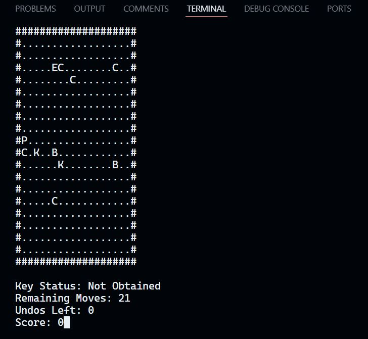

# Unseen Journey

## Overview

This project is a terminal-based maze game built using C++ and the `ncurses` library for handling input and output in the terminal. The player navigates through a maze to find a key and reach the exit, avoiding bombs and collecting coins along the way. The maze generation and game mechanics are determined by the level chosen by the player, which affects the maze size and difficulty.

## Table of Contents

1. [Overview](#overview)
2. [Features](#features)
3. [How the Game Works](#how-the-game-works)
4. [Installation](#installation)
    - [Ubuntu](#ubuntu)
    - [Arch Linux](#arch-linux)
    - [Windows (WSL2)](#windows-wsl2)
5. [Running the Game](#running-the-game)
6. [Project Structure](#project-structure)

## Features

- Randomly generated maze based on the selected difficulty level.
- Three difficulty levels:
  - **Level 1 (Easy)**: Small maze with more moves and undos.
  - **Level 2 (Medium)**: Medium-sized maze with fewer moves.
  - **Level 3 (Hard)**: Large maze with minimum moves and undos.
- Player collects coins, avoids bombs, finds the key, and exits the maze.
- Move counters and undo functionality (limited based on the level).
- Win and game-over conditions based on player actions.

## How the Game Works

- At the start, the player is prompted to select a difficulty level (1, 2, or 3).
- The maze is generated based on the chosen level, with random placement of the player, key, exit, bombs, and coins.
- The player navigates the maze using the following controls:
  - **W**: Move up
  - **A**: Move left
  - **S**: Move down
  - **D**: Move right
  - **Q**: Quit the game
- The objective is to find the key and then the exit while avoiding bombs.
- The player has a limited number of moves, which depends on the maze size and difficulty level.

## Installation

This section explains how to install the necessary dependencies and set up the project on various systems.

### Ubuntu

1. Install the necessary packages, including `ncurses`:
   ```bash
   sudo apt update
   sudo apt install libncurses5-dev libncursesw5-dev
   ```

2. Clone the repository:
   ```bash
   git clone https://github.com/Mnb-0/DSA_2.git
   cd <repository_directory>
   ```

3. Compile the project:
   ```bash
   g++ DS_B_i232623_main.cpp DS_B_i232623_Cell.cpp DS_B_i232623_Maze.cpp DS_B_i232623_Player.cpp DS_B_i232623_Stack.cpp DS_B_i232623_Util.cpp -lncurses -o maze_game
   ```

4. Run the game:
   ```bash
   ./maze_game
   ```

### Arch Linux

1. Install `ncurses` using `pacman`:
   ```bash
   sudo pacman -S ncurses
   ```

2. Clone the repository:
   ```bash
   git clone https://github.com/Mnb-0/DSA_2.git
   cd <repository_directory>
   ```

3. Compile the project:
   ```bash
   g++ main.cpp Maze.cpp Cell.cpp Player.cpp Stack.cpp -lncurses -o maze_game
   ```

4. Run the game:
   ```bash
   ./maze_game
   ```

### Windows (WSL2)

If you're using WSL2 on Windows, follow these steps to set up the project.

1. Install `ncurses` on your WSL2 distribution (Ubuntu or Arch).

   For Ubuntu:
   ```bash
   sudo apt update
   sudo apt install libncurses5-dev libncursesw5-dev
   ```

   For Arch:
   ```bash
   sudo pacman -S ncurses
   ```

2. Clone the repository:
   ```bash
   git clone https://github.com/Mnb-0/DSA_2.git
   cd <repository_directory>
   ```

3. Compile the project:
   ```bash
   g++ main.cpp Maze.cpp Cell.cpp Player.cpp Stack.cpp -lncurses -o maze_game
   ```

4. Run the game:
   ```bash
   ./maze_game
   ```

**Note**: Ensure that your WSL2 terminal supports `ncurses` (Windows Terminal or similar). You can also use an X server like `VcXsrv` for better graphical output if needed.

## Running the Game

After compiling the project, run the game using the generated binary:

```bash
./maze_game
```

The game will start in the terminal, and you'll be prompted to enter the maze level (1, 2, or 3). Use the keyboard controls to navigate the maze.

## Project Structure

The project is organized as follows:

```
.
├── main.cpp           # Entry point of the game
├── Maze.cpp           # Maze generation and game logic
├── Player.cpp         # Player class handling player actions
├── Cell.cpp           # Cell class representing each maze cell
├── Stack.cpp          # Stack class for undo operations
├── Util.cpp           # Utility functions (e.g., random generation)
├── Maze.h             # Header for Maze class
├── Player.h           # Header for Player class
├── Cell.h             # Header for Cell class
├── Stack.h            # Header for Stack class
├── Util.h             # Header for utility functions
└── README.md          # Project documentation

```

## Screenshots

Here are some screenshots of the game in action:

### Screenshot 1


### Screenshot 2


### Screenshot 3


### Screenshot 4


### Screenshot 5
